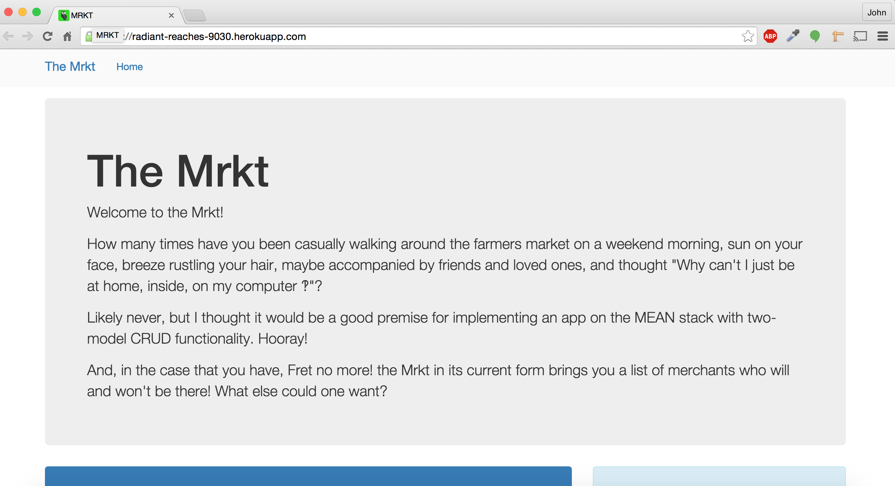
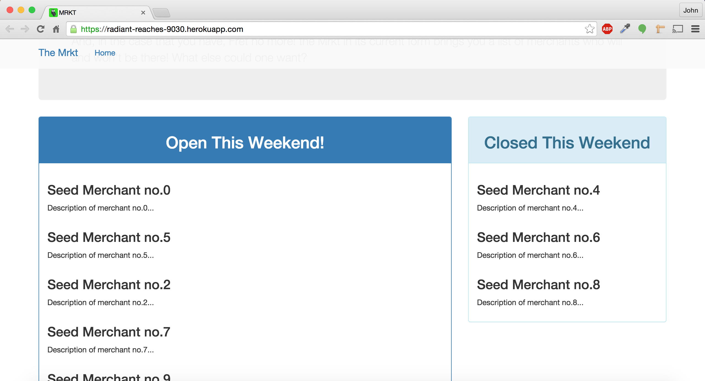
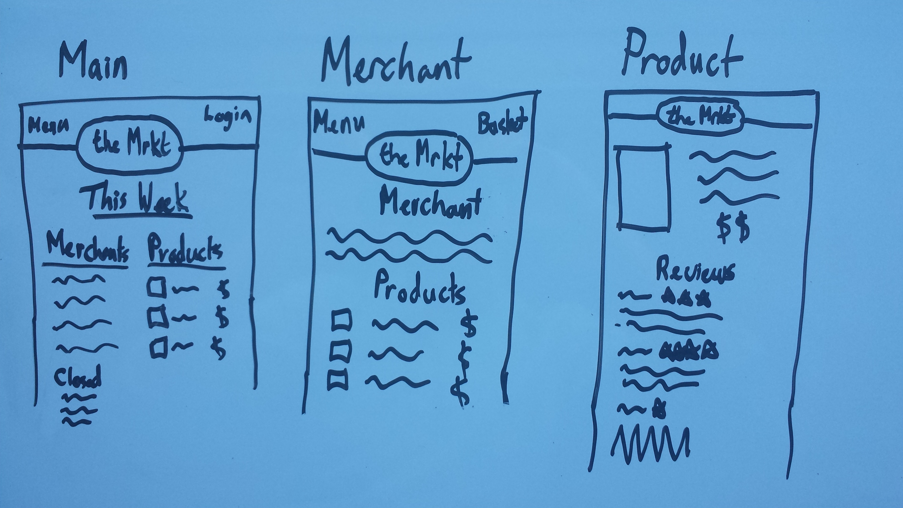

# The Mrkt

Hello and welcome to the Mrkt, a single page application built on the MEAN stack. The app is hosted on Heroku and the database on MongoLab.

## Screenshot
Welcome!

Merchants

## Technologies
### MongoDb
NoSQL database. Set up took a while and I spent a lot of time trying to understand differences from relational dbs. In reflection it would have been a lot better to just start working. Documents are BSON (binary json) and stored in collections (analogous to tables).

### Mongoose.js
ORM for MongoDB. Really facilitated some things and caused some confusion in other places. Based on schemas which define models. Models are constructors for Mongo documents.

### MongoLab
Heroku doesn't host mongo databases but MongoLab offers db as a service for free and paid as a project scales. Really nice to be able to easily hook-up to the same DB in development and production.

### Node.js
Runtime environment for JS

### Express.js
Web development server framework. Gives a ton of flexibility in how you want to set up your app and which middle-ware you want to use.

### Jade
Templating language makes writting html a ton easier and debugging a ton harder.

### Stylus
Syntactically flexible templating for css. Works a lot like Sass

### Angular.js
Front-end framework hijacks html to make elements more like widgets. Facilitates making web apps in an environment which was created for displaying and linking static documents.

### Dependency Management
#### npm
Package Management
#### bower
Asset Management

## Installation
### Running locally requires
1. git - clone or fork and clone this repository
2. MongoDb - this is actually kind of involved and the MongoDB Installation guide skimmed over dealing with system files which always makes me nervous. If you have trouble with permissions and the /data/db checkout [this stack overflow answer](http://stackoverflow.com/questions/7948789/mongodb-mongod-complains-that-there-is-no-data-db-folder?answertab=votes#tab-top) but with the amendment in [this comment](http://stackoverflow.com/questions/7948789/mongodb-mongod-complains-that-there-is-no-data-db-folder?answertab=votes#comment40047872_7948986)
3. node & npm - npm install dependencies
4. bower install
5. Create a front-end!

## User Stories
- As a customer, I would like to see what which merchants are going to be at market.
- As a customer, I would like to see information about products.
- As a merchant, I would like to be able to create a page
- As a merchant, I would like to be able to list products
- As a merchant, I would like to be able to mark inventory as out of stock
- As a merchant, I would like to be able to close without deleting my account

## Wireframes

## Unsolved Problems
1. Tons to add to the front end (pretty much all of it)
2. Break up massive server.js file
3. Add authorization and permissions
4. Long term would like to add users and an ordering model

## Major Hurdles
- MongoDB and Mongoose took me a really long time getting started. I think I made it more difficult that it should have been. There's tons of great documentation
- When working on a seeds file, a few problems with asynchronicity surprised me
- Having an app.get("\*") route as a last route which would redirect to index was an absolute nightmare. Maybe put it in at production but not during development
